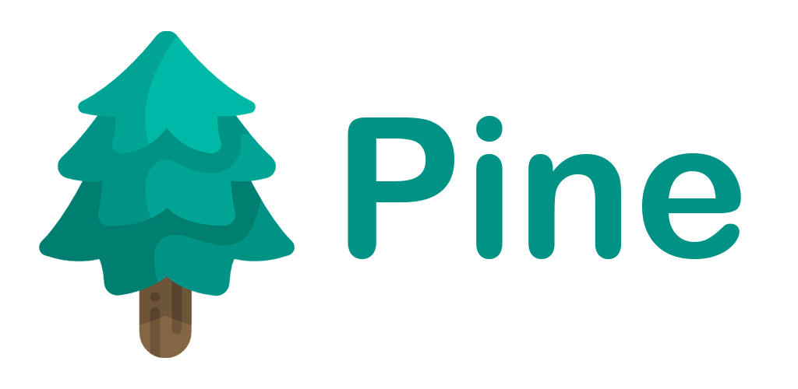
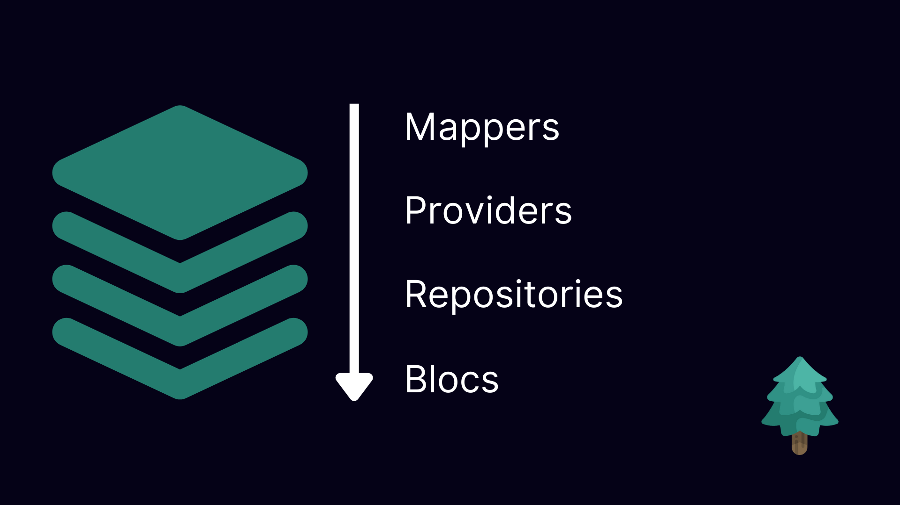
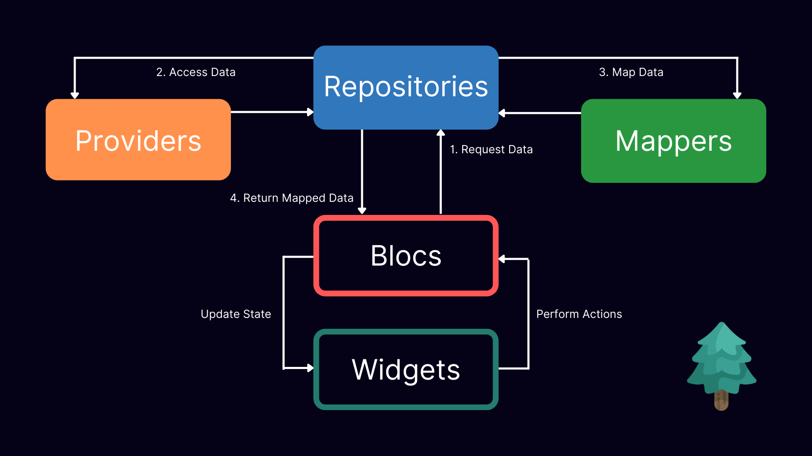

# Pine



A lightweight architecture helper for your Flutter projects

[](https://pub.dev/packages/pine)

[](https://github.com/MyLittleSuite/pine)
[](https://opensource.org/licenses/MIT)

If you want to support this project,

[](https://www.buymeacoffee.com/angeloavv)

## Getting started

Pine relies on the following dependencies:
* [Provider](https://pub.dev/packages/provider)
* [Flutter BLoC](https://pub.dev/packages/flutter_bloc)

With this tool, you will easily define the architecture of your Flutter application using Provider to inject elements in the widget tree and BLoC as a state manager.

### Installation

This package is intended to support development of Flutter projects. In
general, put it under
[dependencies](https://dart.dev/tools/pub/dependencies),
in your [pubspec.yaml](https://dart.dev/tools/pub/pubspec):

```yaml
dev_dependencies:
  pine: ^1.0.0
```

You can install packages from the command line:

```terminal
flutter pub get
```

or simply add it through the command line:

```terminal
flutter pub add pine
```

## How it Works

#### The architecture
Elements are injected from top to bottom. 
1. The first elements added in the widget tree are mappers, particularly useful to convert data coming from data layers to something that should be used in the presentation layer.
2. The second elements are providers: here you can inject services that manipulate data or access to it like REST clients or DAOs interfaces.
3. The third layer is used to inject the repositories that access to the data layer using an abstraction layer.
4. The last layer is used to inject the logic: Pine relies on BLoC as a state manager, that's why we'll inject global scoped BLoCs.

Each element might rely on the top level ones and are generally accessed from the bottom level ones: for instance a repository may need to access to a REST client service to gather data, save it into a database, and the return it to a BLoC.
To access top-level items, you can use the read and watch functions exposed by Provider.



#### The interactions


## Usage

A pine architecture can be achieved by using the DependencyInjectorHelper widget, which helps you to inject different types of elements into the widget tree.
If you are working on a simple project, you should use the DependencyInjectorHelper straight into your main app widget.

Example:
```dart
class App extends StatelessWidget {
  const App({Key? key}) : super(key: key);

  @override
  Widget build(BuildContext context) => DependencyInjectorHelper(
    blocs: [
      BlocProvider<NewsBloc>(
        create: (context) => NewsBloc(
          newsRepository: context.read(),
        )..fetchNews(),
      ),
    ],
    mappers: [
      Provider<DTOMapper<ArticleDTO, Article>>(
        create: (_) => ArticleMapper(),
      ),
    ],
    providers: [
      Provider<Dio>(
        create: (_) => Dio(),
      ),
      Provider<NewsService>(
        create: (context) => NewsService(
          context.read(),
          baseUrl: 'https://newsapi.org/v2/',
        ),
      ),
    ],
    repositories: [
      RepositoryProvider<NewsRepository>(
        create: (context) => NewsRepositoryImpl(
          newsService: context.read(),
          mapper: context.read(),
        ),
      ),
    ],
    child: MaterialApp(
      debugShowCheckedModeBanner: false,
      title: 'News App',
      theme: ThemeData(
        primarySwatch: Colors.blue,
        visualDensity: VisualDensity.adaptivePlatformDensity,
      ),
      home: const HomePage(),
    ),
  );
}
```

As the project grows, it's better to create a new widget that wraps all of these items in different files. We can name this widget DependencyInjector.
dependency_injector.dart:
```dart

part 'blocs.dart';
part 'mappers.dart';
part 'providers.dart';
part 'repositories.dart';

class DependencyInjector extends StatelessWidget {
  final Widget child;

  const DependencyInjector({
    Key? key,
    required this.child,
  }) : super(key: key);

  @override
  Widget build(BuildContext context) => DependencyInjectorHelper(
    blocs: _blocs,
    providers: _providers,
    mappers: _mappers,
    repositories: _repositories,
    child: child,
  );
}
```

In this widget, we need to define all the dependencies that are required in our project. I prefer splitting these elements into different files according to their type.
In our example, we will create four different files because we inject blocs, mappers, providers, and repositories.

blocs.dart
```dart
part of 'dependency_injector.dart';

final List<BlocProvider> _blocs = [
  BlocProvider<NewsBloc>(
    create: (context) => NewsBloc(
      newsRepository: context.read(),
    )..fetchNews(),
  ),
];
```

mappers.dart
```dart
part of 'dependency_injector.dart';

final List<SingleChildWidget> _mappers = [
  Provider<DTOMapper<ArticleDTO, Article>>(
    create: (_) => ArticleMapper(),
  ),
];
```

providers.dart
```dart
part of 'dependency_injector.dart';

final List<SingleChildWidget> _providers = [
  Provider<Dio>(
    create: (_) => Dio(),
  ),
  Provider<NewsService>(
    create: (context) => NewsService(
      context.read(),
      baseUrl: 'https://newsapi.org/v2/',
    ),
  ),
];
```

repositories.dart
```dart
part of 'dependency_injector.dart';

final List<RepositoryProvider> _repositories = [
  RepositoryProvider<NewsRepository>(
    create: (context) => NewsRepositoryImpl(
      newsService: context.read(),
      mapper: context.read(),
    ),
  ),
];
```

Once we finished defining the global dependencies to inject into the widget tree, we need to wrap our MaterialApp/CupertinoApp with the DependencyInjector widget as follows:
```dart
class App extends StatelessWidget {
  const App({Key? key}) : super(key: key);

  @override
  Widget build(BuildContext context) => DependencyInjector(
    child: MaterialApp(
      debugShowCheckedModeBanner: false,
      title: 'News App',
      theme: ThemeData(
        primarySwatch: Colors.blue,
        visualDensity: VisualDensity.adaptivePlatformDensity,
      ),
      home: const HomePage(),
    ),
  );
}
```

### Testing
With the DependencyInjectorHelper it's easy to inject dependencies into the widget tree.
Simply wrap the widget you need to test with the DependencyInjectorHelper class and inject the dependencies you need.

In the following example, we will test the HomePage widget which relies on NewsBloc. Before pumping the MaterialApp containing the HomePage, we will wrap it as follows:

```dart
    await tester.pumpWidget(
      DependencyInjectorHelper(
        blocs: [
          BlocProvider<NewsBloc>.value(value: newsBloc),
        ],
        child: const MaterialApp(
          home: HomePage(),
        ),
      ),
    );
```

Of course, since we are testing the HomePage, we are injecting a mocked newsBloc. 

## License

Pine is available under the MIT license. See the LICENSE file for more info.

## Additional information

<a href="https://www.flaticon.com/free-icons/pine" title="pine icons">Pine icons created by Freepik - Flaticon</a>